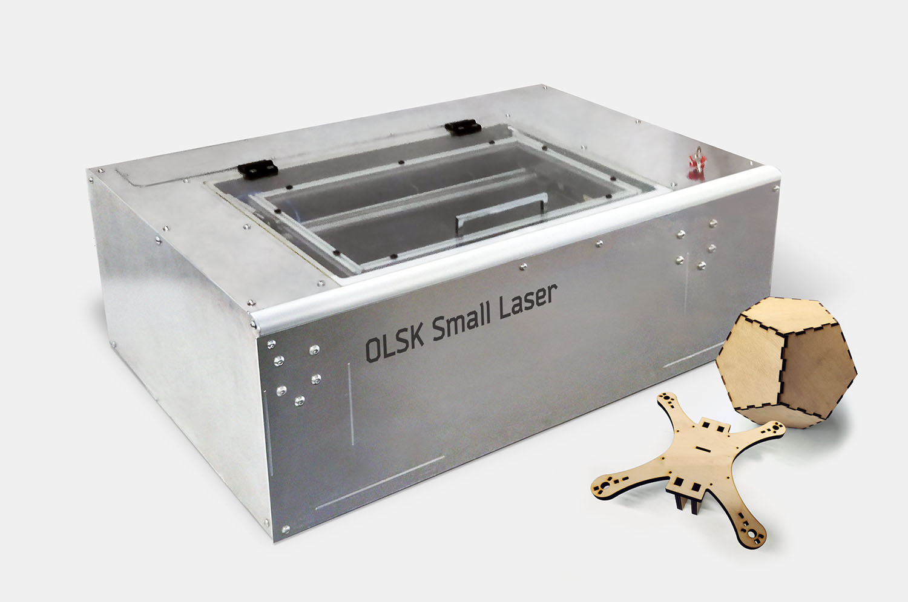
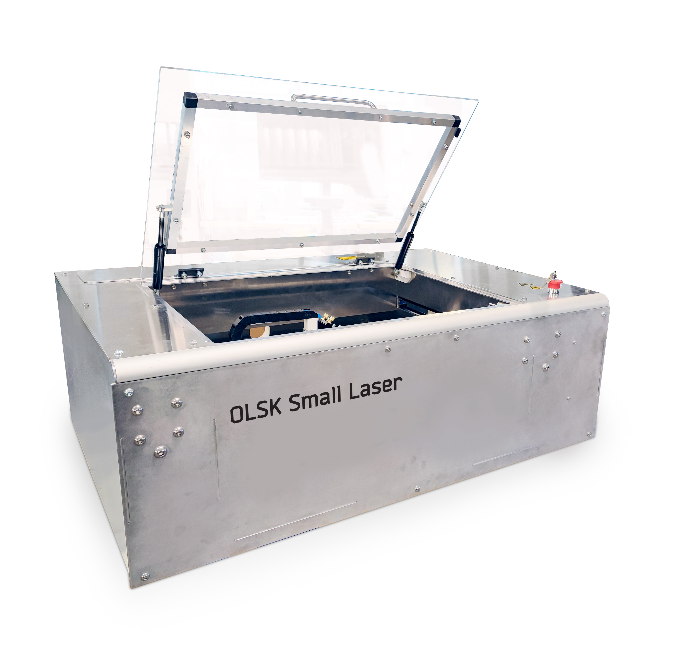
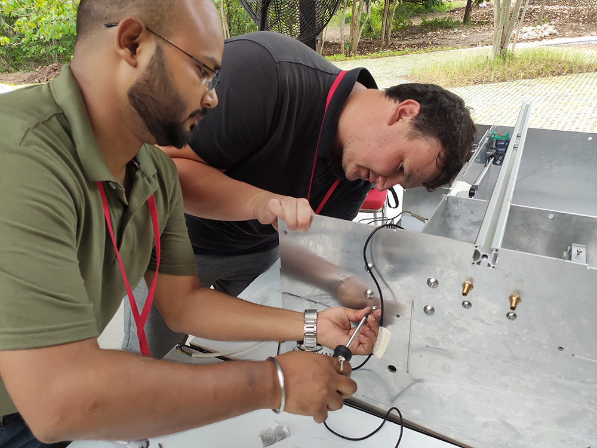
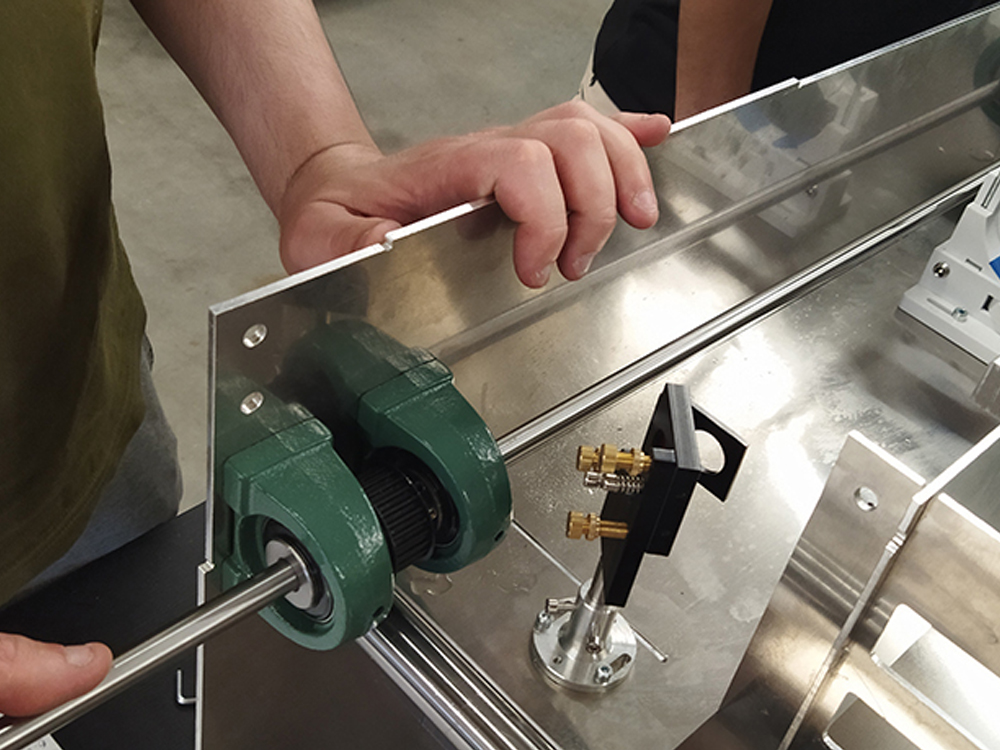
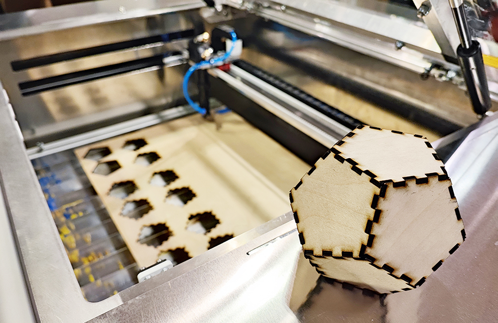
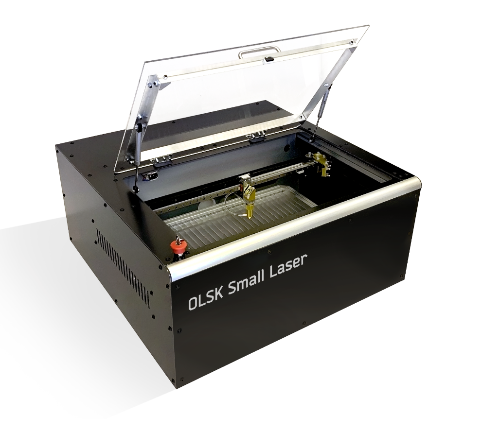

<h1 style=align="center">OLSK Small Laser V2</h1>

<i>Open Source Laser Cutter - Small version - Open Lab Starter Kit</i>

 

Introduction
--

The OLSK Small Laser V2 is a compact but powerful desktop laser cutter. It features the design of the **[Fabulaser Mini](https://github.com/fab-machines/Fabulaser-Mini)**, developed to fit in Fab Labs and classrooms. It aims to lower the boundaries of accessing laser-cutting technology, representing an ideal compromise between performance and cost. With an optimized 40W CO2 laser, it can cut 8mm acrylic, and with a cutting area of 600x400mm is one the largest of this machine category. The compact machine size of 1161 x 812 x 390 mm allows usage in small rooms with a normal table or a desk.

 

A tool to make, a tool to learn.
--

 

In comparison to commercial laser cutters, OLSK Small Laser adds on top of the laser cutting functionalities a valuable learning experience. Ideally built together with students during a workshop, OLSK Small Laser will give the user not only the possibility to laser cut but also to learn how the machine is made, and how it works. The final user will not only be learning about electronics, mechanics and lasers, but will also have a deep knowledge of the machine, to be able to efficiently execute maintenance, apply improvements and even design their own machine later on!

The Assembly Manual 
--

All OLSK machines are open source and have an assembly manual, the BOM and necessary files available in this repository for replication. The assembly manual is an interactive 3D guide though each step and contains a list of parts, tools and instruction remarks, which follows a logic order to provide a smooth assembly.

- **[Assembly Manual](https://open-lab-starter-kit.github.io/OLSK-Small-Laser/)**

The Kit
--

OLSK Small Laser Kit, is the one-stop solution for everything you need to fully use the laser cutting capabilities of OLSK Small Laser. Providing all the required parts and special tools to build the laser cutter, OLSK Small Laser kit also provides all the additional accessories to start laser cutting out of the box. As well as all the required adapters and connections are provided, so that the user only have to concentrate on assembly, without losing time in searching and buying additional parts.

Included in the OLSK Small Laser Kit:

- machine parts
- air assist compressor
- exhaust radial fan
- indoor air filter
- water chiller
- all the required connections/adapters

Specifications
--

 

- laser source: 40W CO2
- cutting area: 600x400mm
- resolution: 0.05mm 
- max. cutting thickness: 
  - 10mm acrylic
  - 6mm MDF
  - 8mm Plywood
- max speed: 1000mm/s
- motion: linear rails and linear shafts
- frame and housing: interlocked aluminum plates
- bed: aluminum lamella
- sensors: inductive probes
- controller: 32bit Teensy 4.1
- firmware: [grbl-hal]([https://github.com/cprezzi/grbl-LPC](https://github.com/grblHAL/iMXRT1062))
- machine dimensions: 1161x812x390mm

Files
--

- **[BOM](OLSK_Small_Laser_V2_BOM.pdf)**
- **[Firmware](firmware)**
- **[CAD](cad)**
- **[Settings](settings)**
- **[Workbook](OLSK_Small_Laser_V2_Workbook.pdf)**
- **[Wiring Schematic](WiringSchematic_OLSK_Small_Laser_V2.pdf)**
- **[PCB](https://github.com/Open-Lab-Starter-Kit/OLSK-Electronics/tree/main/Laser_Controller_Shield_V1-0)**

Authors
--

OLSK Small Laser V2 has been designed, developed and manufactured by: 

- **Daniele Ingrassia, daniele@inmachines.net**
- **[InMachines Ingrassia GmbH](https://www.inmachines.net/)** 

License
--

The Fabulaser Mini hardware design, CAD and PCB files, BOM, settings and relative files are are released under the following open source license:

- CERN Open Hardware Licence Version 2 Weakly Reciprocal - **[CERN-OHL-W](LICENSE_CERN_OHL_W_V2.txt)**

The Fabulaser assembly manual, pictures and presentation text of this repository are released under the following license:

- Creative-Commons-Attribution-ShareAlike 4.0 International - **[CC BY-SA 4.0](LICENSE_CC_BY_SA_4.0.txt)**

Fabulaser Mini uses grbl-LPC [https://github.com/cprezzi/grbl-LPC](https://github.com/cprezzi/grbl-LPC), released under the [GPLv3 license](https://www.gnu.org/licenses/gpl-3.0.en.html).

Previous version
--

Previous versions of Fabulaser Mini will always be available. 

**[OLSK Small Laser V1 Repository](OLSK_Small_Laser_V1)** 

