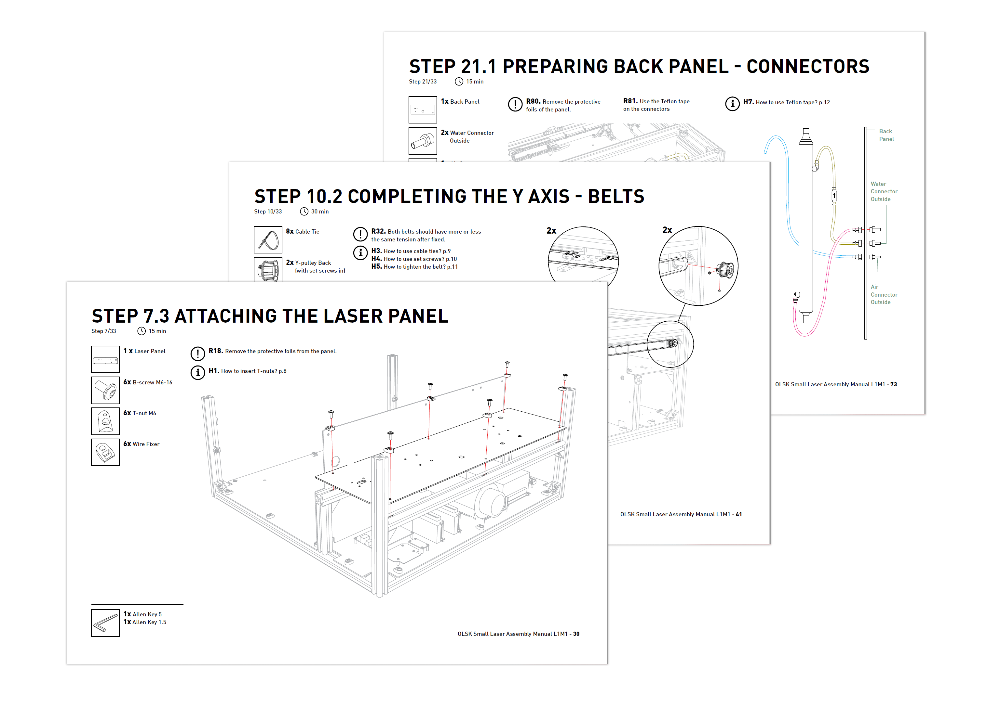

<h1 style=align="center">OLSK Small Laser V1</h1>

<i>Open Source Laser Cutter - Small version - Open Lab Starter Kit</i>

 

Introduction
--

The OLSK Small Laser V1 is a compact but powerful desktop laser cutter. It features the design of the **[Fabulaser Mini](https://github.com/fab-machines/Fabulaser-Mini)**, developed to fit in Fab Labs and classrooms, with a compact size of 870x810x380mm and the weight under 60kg. It uses an optimized 40W CO2 laser, being able to cut 8mm acrylic. With a cutting area of 600x400mm, is one the largest of this machine category. 

Learning by Making
--

The assembly of the OLSK Small Laser provides a unique learning experience. With the help of a workshop and the assembly manual, this laser cutter can be built in a few days, allowing the participants to understand the role of each part and how the mechanics, optics and electronics function from inside out. 

The Assembly Manual
--

Just like the **[Fabulaser Mini](https://github.com/fab-machines/Fabulaser-Mini)**, the OLSK Small Laser V1 comes with a detailed building manual. Divided in logical steps, the manual also instructs on general building practices, the laser calibration and how to connect all the electronics of the machine. Teachers and lectures can also use the manual to divide workshop participants into building groups. 

Specifications V1
--

- laser source: 40W CO2
- cutting area: 600x400mm
- frame: 30x30mm aluminum profiles
- resolution: 0.05mm
- max. cutting thickness:
    - 8mm acrylic
    - 6mm MDF
    - 8mm Plywood
- max speed: 400mm/s
- motion: linear rails
- housing: aluminum composite
- bed: aluminum lamella
- frame: 30 x 30 mm aluminum profiles
- controller: 32bit LPC1768
- firmware: grbl-LPC
- machine dimensions: 870x810x380mm
- motion: GT2 10mm belts
- guides: 12mm linear rails
- motors: stepper NEMA 17

Files
--

- **[Assembly manual](https://github.com/Open-Lab-Starter-Kit/OLSK-Small-Laser/tree/main/manual)**
- **[BOM](https://github.com/Open-Lab-Starter-Kit/OLSK-Small-Laser/blob/main/OLSK_Small_Laser_V1_BOM.pdf)**
- **[Firmware](https://github.com/Open-Lab-Starter-Kit/OLSK-Small-Laser/tree/main/firmware/24.10.2021/grbl-LPC.zip)**
- **[CAD](https://github.com/Open-Lab-Starter-Kit/OLSK-Small-Laser/tree/main/cad)**

Author
--

 

OLSK Small Laser has been designed and built by **[InMachines Ingrassia GmbH](https://www.inmachines.net/)**.

Machine design:
- **[Daniele Ingrassia](https://www.linkedin.com/in/danieleingrassia/)**

The machine is part of the **[Open Lab Starter Kit (OLSK)](https://www.inmachines.net/open-lab-starter-kit)** group of open source digital fabrication machines.

OLSK is developed by **[InMachines Ingrassia GmbH](https://www.inmachines.net/)** for the **[Dtec project](https://dtecbw.de/home/forschung/hsu/projekt-fabcity)** at **[Fab City Hamburg](https://www.fabcity.hamburg/en/)**.

OLSK Partners:
  

Contact
--

- daniele@inmachines.net
- [https://www.inmachines.net/](https://www.inmachines.net/)

License
--

Hardware design, CAD and PCB files, BOM, settings and other technical or design files are released under the following license:

- CERN Open Hardware Licence Version 2 Weakly Reciprocal - **[CERN-OHL-W](LICENSE_CERN_OHL_W_V2.txt)**

Assembly manual, pictures, videos, presentations, description text and other type of media are released under the following license:

- Creative-Commons-Attribution-ShareAlike 4.0 International - **[CC BY-SA 4.0](LICENSE_CC_BY_SA_4.0.txt)**
